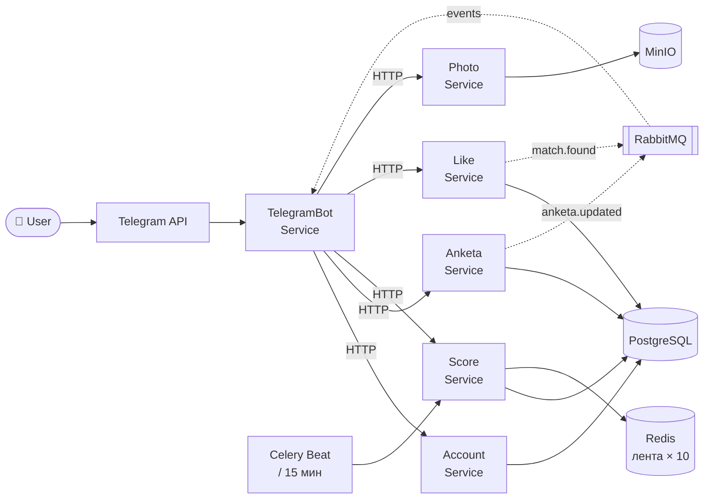

# MatchBot — Telegram Dating App

Проект представляет собой бота для знакомств в Telegram. Пользователь регистрируется, создаёт анкету, загружает фото и начинает смотреть анкеты других. Если два человека лайкнули друг друга — происходит мэтч и они могут общаться.

---

## Сервисы

### 🤖 TelegramBot Service
**Стек:** Python, aiogram 3

Сервис отвечает за всё общение с пользователем. Реализует конечный автомат (FSM) для пошаговой регистрации. Отображает анкеты с inline-кнопками, принимает реакции пользователя. При получении события о мэтче из очереди — отправляет уведомление обоим участникам.

Точки входа:
- `/start` — начало работы, создание пользователя
- `/myprofile` — просмотр своей анкеты
- `/look` — режим просмотра анкет
- `/mymatch` — список мэтчей

### 👤 Account Service
**Стек:** Python, FastAPI, PostgreSQL

Управляет аккаунтами пользователей. Создаёт запись при первом обращении, хранит `telegram_id` и базовые данные. Остальные сервисы обращаются к нему для валидации пользователя.

### 📋 Anketa Service
**Стек:** Python, FastAPI, PostgreSQL

Хранит анкеты: имя, возраст, пол, город, описание, интересы и предпочтения к партнёру. Полный CRUD. При изменении анкеты бросает событие в очередь — Score Service пересчитывает рейтинг.

### ⭐ Score Service
**Стек:** Python, FastAPI, PostgreSQL, Redis

Считает рейтинг анкет по трём уровням и формирует ленту для каждого пользователя. Готовая лента из 10 анкет хранится в Redis. Пока пользователь листает — анкеты отдаются из кэша мгновенно. Когда лента заканчивается — пересчёт и новые 10 в Redis.

Уровни подсчёта рейтинга:
- **primary** — заполненность анкеты и количество фото
- **behavioral** — лайки, пропуски, мэтчи от других пользователей
- **final** — взвешенная сумма первых двух

### 💘 Like Service
**Стек:** Python, FastAPI, PostgreSQL

Принимает лайки и пропуски. Каждый лайк проверяется на взаимность. Нашёлся встречный лайк — создаётся мэтч, событие уходит в очередь на уведомление.

### 🖼 Photo Service
**Стек:** Python, FastAPI, MinIO

Загружает фотографии в MinIO (S3-хранилище), возвращает ключ файла. Anketa Service хранит только ключ, сами файлы хранятся отдельно в MinIO. Лимит — 5 фото на профиль.

---

## Архитектура



---

## База данных

```sql
-- аккаунты пользователей
CREATE TABLE accounts (
    id          UUID PRIMARY KEY DEFAULT gen_random_uuid(),
    tg_id       BIGINT UNIQUE NOT NULL,
    tg_username VARCHAR(64),
    joined_at   TIMESTAMPTZ DEFAULT NOW(),
    is_active   BOOLEAN DEFAULT TRUE
);

-- анкеты
CREATE TABLE anketas (
    id           UUID PRIMARY KEY DEFAULT gen_random_uuid(),
    account_id   UUID UNIQUE NOT NULL REFERENCES accounts(id) ON DELETE CASCADE,
    display_name VARCHAR(100) NOT NULL,
    age          SMALLINT NOT NULL CHECK (age BETWEEN 18 AND 100),
    gender       VARCHAR(10) NOT NULL,
    city         VARCHAR(100),
    about        TEXT,
    tags         TEXT[],
    want_age_min SMALLINT DEFAULT 18,
    want_age_max SMALLINT DEFAULT 60,
    want_gender  VARCHAR(10),
    want_city    VARCHAR(100),
    photo_count  SMALLINT DEFAULT 0,
    visible      BOOLEAN DEFAULT TRUE,
    updated_at   TIMESTAMPTZ DEFAULT NOW()
);

-- фотографии
CREATE TABLE photos (
    id         UUID PRIMARY KEY DEFAULT gen_random_uuid(),
    anketa_id  UUID NOT NULL REFERENCES anketas(id) ON DELETE CASCADE,
    file_key   VARCHAR(255) NOT NULL,
    position   SMALLINT DEFAULT 0,
    added_at   TIMESTAMPTZ DEFAULT NOW()
);

-- рейтинги (пересчёт через Celery)
CREATE TABLE scores (
    anketa_id      UUID PRIMARY KEY REFERENCES anketas(id) ON DELETE CASCADE,
    primary_score  FLOAT DEFAULT 0.0,
    behav_score    FLOAT DEFAULT 0.0,
    final_score    FLOAT DEFAULT 0.0,
    like_count     INTEGER DEFAULT 0,
    skip_count     INTEGER DEFAULT 0,
    updated_at     TIMESTAMPTZ DEFAULT NOW()
);

-- лайки / пропуски
CREATE TABLE reactions (
    id         UUID PRIMARY KEY DEFAULT gen_random_uuid(),
    from_acc   UUID NOT NULL REFERENCES accounts(id),
    to_anketa  UUID NOT NULL REFERENCES anketas(id),
    type       VARCHAR(10) NOT NULL, -- 'like' | 'skip'
    reacted_at TIMESTAMPTZ DEFAULT NOW(),
    UNIQUE(from_acc, to_anketa)
);

-- мэтчи
CREATE TABLE matches (
    id         UUID PRIMARY KEY DEFAULT gen_random_uuid(),
    acc_a      UUID NOT NULL REFERENCES accounts(id),
    acc_b      UUID NOT NULL REFERENCES accounts(id),
    matched_at TIMESTAMPTZ DEFAULT NOW(),
    active     BOOLEAN DEFAULT TRUE,
    UNIQUE(acc_a, acc_b)
);

CREATE INDEX idx_scores_final  ON scores(final_score DESC);
CREATE INDEX idx_anketas_city  ON anketas(city, age);
CREATE INDEX idx_reactions_acc ON reactions(from_acc);
```

### ER-схема

```
accounts ──1:1── anketas ──1:N── photos
                    │
                    └──1:1── scores

accounts ──N:M── reactions
accounts ──N:M── matches
```

---

## Стек

| | |
|---|---|
| Bot | aiogram 3.x |
| API сервисы | FastAPI |
| БД | PostgreSQL |
| Кэш | Redis |
| Очередь | RabbitMQ |
| Фото | MinIO (S3) |
| Фон. задачи | Celery + Celery Beat |
| Deploy | Docker Compose |
